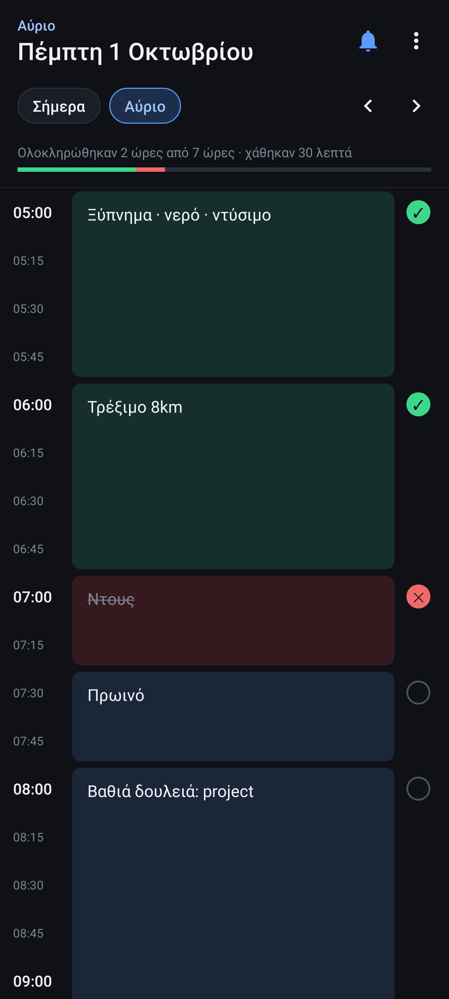

# Timetable

Ημερήσιο πρόγραμμα σε κουτάκια των 15 λεπτών (05:00 – 24:00), για να γράφεις από το
προηγούμενο βράδυ τι θα κάνεις την επόμενη μέρα και να το τσεκάρεις (✓ / ✗) μέσα στη μέρα.



## Εγκατάσταση

Κατέβασε το [`apk/Timetable.apk`](apk/Timetable.apk) στο κινητό και άνοιξέ το. Το Android θα
ζητήσει να επιτρέψεις «εγκατάσταση από άγνωστες πηγές» για την εφαρμογή από την οποία το άνοιξες
(Chrome, Files κ.λπ.).

## Χρήση

- **Σήμερα / Αύριο**: γρήγορη εναλλαγή ημέρας. Με ‹ › πας μέρα-μέρα, πατώντας την ημερομηνία διαλέγεις από ημερολόγιο.
- **Πάτα ένα κουτί** → γράφεις τι θα κάνεις και διαλέγεις διάρκεια (15', 30', 1ω… ή με − / +).
  Τα κουτιά με την ίδια δραστηριότητα ενώνονται σε ένα block.
- **Πάτα ένα γεμάτο block** → αλλάζεις κείμενο/διάρκεια ή το διαγράφεις.
- **Κράτα πατημένο** ένα γεμάτο κουτί → νέα δραστηριότητα από εκείνη ακριβώς την ώρα.
- **Κύκλος δεξιά**: ○ → ✓ (έγινε) → ✗ (δεν έγινε). Πάνω δεξιά βλέπεις πόσες ώρες έβγαλες.
- **🔔 (πάνω δεξιά)**: ειδοποίηση στην αρχή κάθε δραστηριότητας, ανοίγει/κλείνει ξεχωριστά για κάθε μέρα.
  Από το ⋮ → «Ειδοποιήσεις σε νέες μέρες» ορίζεις αν οι μέρες ξεκινούν με ή χωρίς ειδοποιήσεις.
- **⋮**: αντιγραφή προγράμματος από χθες ή άλλη μέρα, μηδενισμός ✓/✗, καθαρισμός ημέρας.
- Μετά τις 18:00, αν δεν έχεις γράψει το αύριο, εμφανίζεται υπενθύμιση πάνω από τη λίστα.

Τα δεδομένα μένουν μόνο στο κινητό.

## Build

```sh
./build.sh   # -> build/Timetable.apk
```

Δεν χρειάζεται Android SDK ή Gradle: το script κατεβάζει από Maven Central τα aapt2
(apktool), android-all (Robolectric), dx και apksig. Χρειάζεται JDK 17+, python3 και curl.

Το `keystore/timetable.p12` (κωδικός `timetable`) υπογράφει το APK. Κράτα το ίδιο κλειδί ώστε
οι νέες εκδόσεις να εγκαθίστανται πάνω στην παλιά χωρίς να χαθούν τα δεδομένα. Για νέα έκδοση
ανέβασε το `VERSION_CODE` στο `build.sh`.
