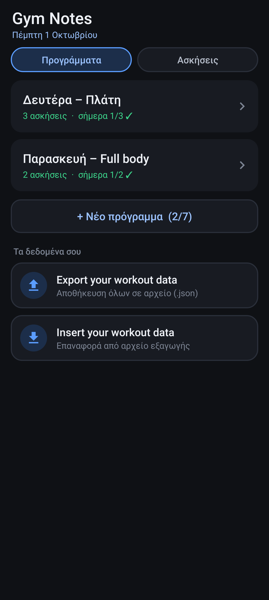
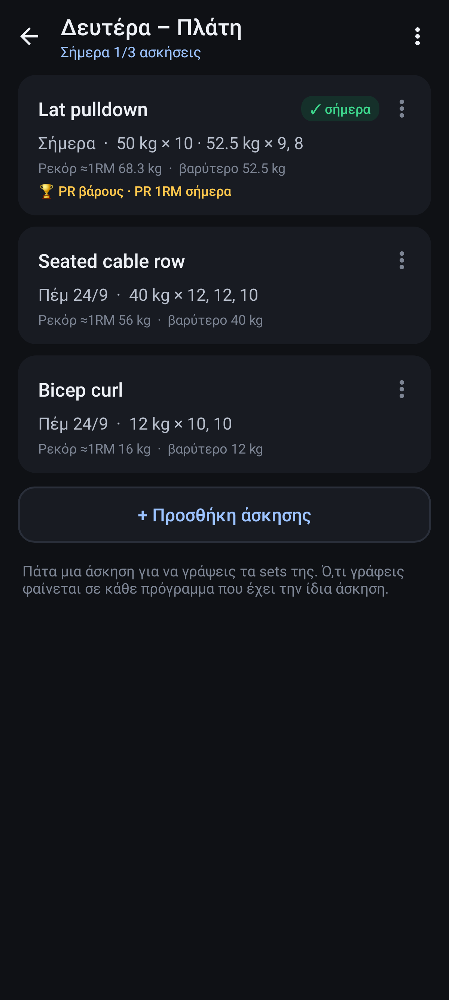
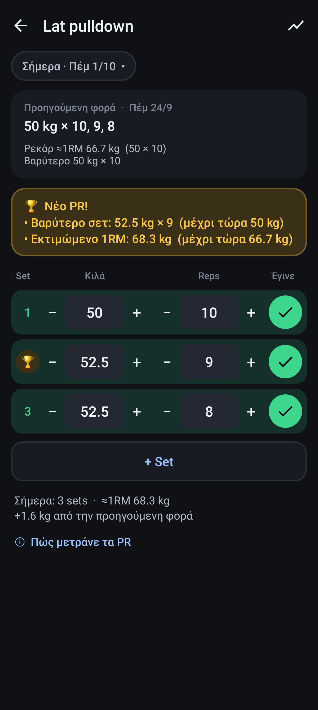
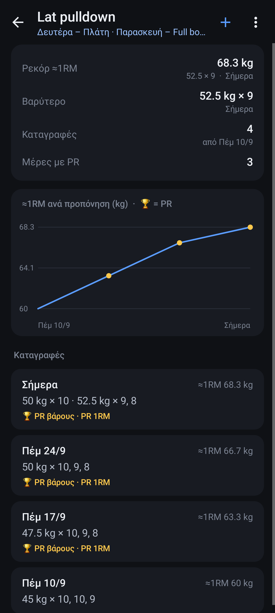

# Gym Notes

Απλό σημειωματάριο γυμναστηρίου: έως 7 προγράμματα (π.χ. ένα για κάθε μέρα), οι ασκήσεις του
καθενός και τα sets / κιλά / reps που έκανες, με αναγνώριση πραγματικών PR.

   

## Εγκατάσταση

Κατέβασε το [`apk/GymNotes.apk`](../apk/GymNotes.apk) στο κινητό και άνοιξέ το. Το Android θα
ζητήσει να επιτρέψεις «εγκατάσταση από άγνωστες πηγές» για την εφαρμογή από την οποία το άνοιξες
(Chrome, Files κ.λπ.). Δουλεύει σε Android 8 και νεότερα (το Motorola G86 έχει Android 15).

## Χρήση

- **Προγράμματα**: «+ Νέο πρόγραμμα» (έως 7). Πάτα ένα πρόγραμμα για να το ανοίξεις. Κράτα το
  πατημένο για μετονομασία, αλλαγή σειράς ή διαγραφή.
- **Μέσα σε πρόγραμμα**: «+ Προσθήκη άσκησης». Ψάχνεις στη λίστα σου ή γράφεις όνομα για νέα άσκηση.
  Κάθε κάρτα δείχνει τι έκανες την τελευταία φορά, το ρεκόρ σου και αν έγινε σήμερα. Με το ⋮ της
  κάρτας αλλάζεις σειρά ή βγάζεις την άσκηση από το πρόγραμμα.
- **Καταγραφή**: πάτα μια άσκηση. Τα sets ξεκινάνε συμπληρωμένα με ό,τι έκανες την προηγούμενη φορά.
  Άλλαξε κιλά / reps (με − / + ή γράφοντας) και πάτα ✓ μόλις τελειώσεις κάθε set. Αποθηκεύεται αμέσως.
  Αν αλλάξεις τα κιλά ενός set, αλλάζουν και τα επόμενα που δεν έχεις τσεκάρει. «+ Set» για
  παραπάνω sets. Κράτα πατημένο ένα set για διαγραφή. Πατώντας την ημερομηνία γράφεις για παλιότερη μέρα.
- **Κοινές ασκήσεις**: μια άσκηση είναι μία, όσα προγράμματα κι αν την έχουν. Αν ανέβασες κιλά στο
  «Lat pulldown» την Παρασκευή, το βλέπεις και στο πρόγραμμα της Δευτέρας.
- **Ασκήσεις** (καρτέλα στην αρχική): όλες οι ασκήσεις σου, με αναζήτηση, «+» για νέα, και με
  παρατεταμένο πάτημα μετονομασία ή διαγραφή. Πάτα μία για ιστορικό, ρεκόρ και γράφημα προόδου.
- **Export your workout data**: αποθηκεύει όλα τα δεδομένα σε ένα αρχείο `.json` όπου θες (Λήψεις,
  Drive κ.λπ.).
- **Insert your workout data**: φέρνει πίσω ένα τέτοιο αρχείο. Διαλέγεις «Συγχώνευση» (κρατάει τα
  τωρινά και προσθέτει όσα λείπουν) ή «Αντικατάσταση» (μένουν μόνο του αρχείου).

## Πότε λέει PR

Δεν μετράει κιλά × reps, γιατί τότε το 1 kg × 100 θα «νικούσε» τα 100 kg × 5. Ένα set είναι PR μόνο
αν, σε σχέση με όλες τις προηγούμενες φορές της άσκησης (από όποιο πρόγραμμα κι αν τις έγραψες):

- **PR βάρους**: σήκωσες περισσότερα κιλά από ποτέ.
- **PR 1RM**: το εκτιμώμενο μέγιστο για 1 επανάληψη (Epley: κιλά × (1 + reps/30)) ξεπέρασε το ρεκόρ
  σου. Μετράνε έως 12 reps: ένα set των 20 λογίζεται σαν 12, ώστε τα ελαφριά set με πολλές
  επαναλήψεις να μη βγάζουν ψεύτικη δύναμη.
- **PR reps**: περισσότερες επαναλήψεις από κάθε άλλη φορά με αυτά τα κιλά ή και βαρύτερα. Μετράει
  μόνο σε κιλά που έχεις ξαναδουλέψει και είναι τουλάχιστον 75% του βαρύτερού σου (ή σωματικό βάρος,
  0 kg). Έτσι τα sets ζεστάματος δεν μετράνε.

Η πρώτη φορά μιας άσκησης είναι η βάση σου, γι' αυτό δεν βγάζει PR. Κάτω από τα sets βλέπεις και
τη σύγκριση με την προηγούμενη φορά (εκτιμώμενο 1RM, όχι όγκο).

## Ταχύτητα με τα χρόνια

Όλα τα δεδομένα είναι σε μία βάση SQLite. Τα sets κάθε άσκησης αποθηκεύονται συνεχόμενα (πίνακας
ταξινομημένος ανά άσκηση και ημέρα), οπότε το άνοιγμα μιας άσκησης διαβάζει μόνο το δικό της κομμάτι.
Τα ρεκόρ και η τελευταία φορά κάθε άσκησης κρατιούνται έτοιμα και ενημερώνονται σε κάθε αλλαγή, οπότε
οι λίστες δεν ψάχνουν ποτέ όλο το ιστορικό. Σε δοκιμή με 2 χρόνια δεδομένων (12 ασκήσεις, 3 φορές τη
βδομάδα, ~15.000 sets) κάθε οθόνη φορτώνει σε περίπου 1 ms. Το export και το import διαβάζουν και
γράφουν το αρχείο τμηματικά (~800 KB για όλα αυτά).

## Build

```sh
gym/build.sh   # -> gym/build/GymNotes.apk
```

Ίδιο toolchain με το Timetable: χωρίς Android SDK ή Gradle, όλα από Maven Central (JDK 17+,
python3, curl). Το `keystore/gymnotes.p12` (κωδικός `gymnotes`) υπογράφει το APK. Κράτα το ίδιο
κλειδί ώστε οι νέες εκδόσεις να εγκαθίστανται πάνω στην παλιά χωρίς να χαθούν τα δεδομένα. Για νέα
έκδοση ανέβασε το `VERSION_CODE` στο `gym/build.sh`.
