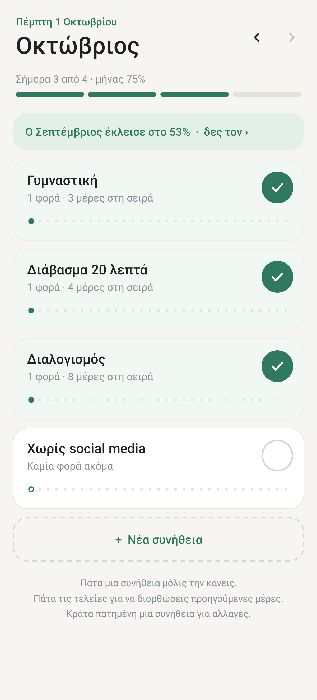
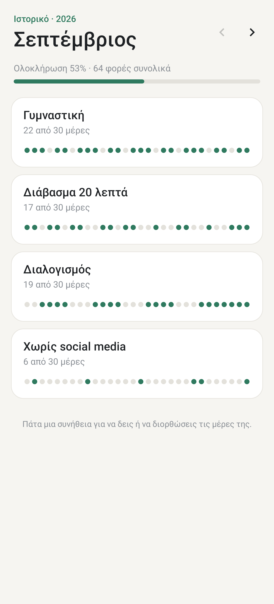

# Habits

Καθημερινές συνήθειες (3 – 6) που τικάρεις μόλις τις κάνεις. Μετράει πόσες φορές έκανες την καθεμία
μέσα στον μήνα και κάθε νέος μήνας ξεκινά από το μηδέν, ενώ οι προηγούμενοι μένουν στο ιστορικό.

 

## Εγκατάσταση

Κατέβασε το [`apk/Habits.apk`](../apk/Habits.apk) στο κινητό και άνοιξέ το. Το Android θα ζητήσει
να επιτρέψεις «εγκατάσταση από άγνωστες πηγές» για την εφαρμογή από την οποία το άνοιξες
(Chrome, Files κ.λπ.). Είναι ξεχωριστή εφαρμογή από το Timetable, οπότε μπαίνουν και οι δύο.

## Χρήση

- **Πάτα μια συνήθεια** μόλις την κάνεις → γεμίζει ο κύκλος ✓. Ξαναπάτα για να το αναιρέσεις.
- **Τελείες** κάτω από κάθε συνήθεια: μία για κάθε μέρα του μήνα. Πατώντας τις ανοίγει ημερολόγιο
  για να τικάρεις ή να ξετικάρεις προηγούμενες μέρες (π.χ. αν ξέχασες χθες).
- **Κράτα πατημένη** μια συνήθεια → μετονομασία, ημερολόγιο, μετακίνηση πάνω / κάτω, διαγραφή.
- **+ Νέα συνήθεια** → γράφεις ή διαλέγεις από τις ιδέες. Μέχρι 6.
- Πάνω: πόσες έγιναν σήμερα και το ποσοστό του μήνα. Δίπλα σε κάθε συνήθεια, πόσες φορές την
  έκανες τον μήνα και πόσες μέρες στη σειρά.
- **‹ ›**: προηγούμενοι μήνες (ιστορικό). Τις πρώτες μέρες κάθε μήνα βλέπεις και πώς έκλεισε ο προηγούμενος.

Αλλαγές στις συνήθειες (νέα, μετονομασία, διαγραφή) αφορούν μόνο τον τρέχοντα μήνα· οι προηγούμενοι
μήνες κρατούν τις συνήθειες που είχαν τότε. Ο νέος μήνας παίρνει αυτόματα τις συνήθειες του προηγούμενου.

Τα δεδομένα μένουν μόνο στο κινητό, ένα μικρό αρχείο ανά μήνα (`files/months/YYYY-MM.json`).

## Build

```sh
./build.sh   # -> build/Habits.apk
```

Ίδια διαδικασία με το Timetable (`../build.sh`): χωρίς Android SDK ή Gradle, με τα ίδια εργαλεία
(`../.tools`, `../tools`) και το ίδιο κλειδί (`../keystore`). Για νέα έκδοση ανέβασε το
`VERSION_CODE` στο `build.sh`.
